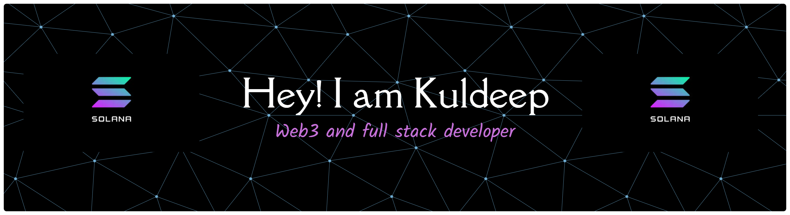

<!-- 🌌 Banner (Optional: add a custom one in your repo as banner.png) -->

<h1 align="center">Hey 👋, I'm Kuldeep Sharma</h1>
<h3 align="center">💜 Full-Stack & Solana Developer | Exploring Web3, AI/ML, and the Future of the Internet</h3>

  

---

### 🧠 About Me  

Hey there! I'm **Kuldeep Sharma**, a developer from India passionate about **building on Solana** and merging **Web + AI + Blockchain** to create something that truly matters.  

- ⚙️ Focused on **Solana, Rust, React, Node.js, and AI/ML**
- 💜 I absolutely love the **Solana ecosystem** and its developer-first community
- 🏆 **2× Web3 Hackathon Winner**  
  - 🥇 *100xDevs Solana Mini Hackathon*  
  - 🥇 *Kwala Hacker House*  
- 🌐 Check out my portfolio: [**web3kuldeep.me**](https://web3kuldeep.me)  
- 💬 “I don’t just build projects — I craft experiments that scale.”  

---

### ⚡ Technologies I Work With  

  
  
  
  
  
  
  
  
  
  
  
  
  
  

---

### 🧩 My Blogs on Medium  

> *“I believe in understanding how things work under the hood — not just using them.”*  

Here are some of my featured Solana-related blogs 👇  

- 🟣 [**How Solana Works: A Beginner’s Guide to Blockchain Design**](https://medium.com/coinmonks/solana-6a945d6072a3)  
- 🕒 [**Proof of History (PoH)**](https://medium.com/coinmonks/proof-of-history-poh-eb8b874b59ee)  
- ⚙️ [**Solana’s First Layer Explained: Users, Wallets, and Accounts**](https://medium.com/coinmonks/weve-built-a-great-understanding-so-far-bed61f4dfef4)

  

---

### 📊 GitHub Stats  

  
  

  

---

### 💻 Connect with Me  

  
  
  
  
  

---

<h3 align="center">⚡ “Built on Solana. Fueled by Curiosity.” ⚡</h3>

  

